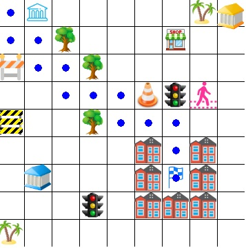
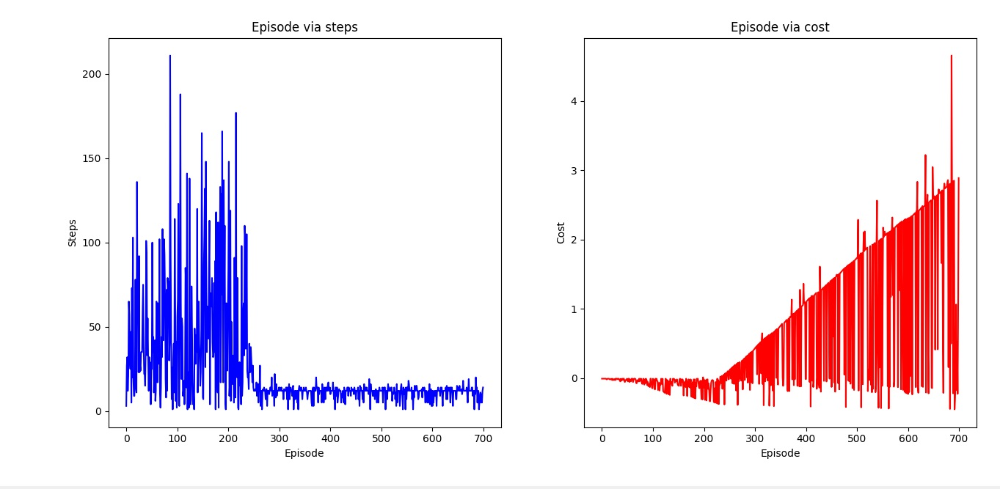

# GameAIusingQlearning
This project implements a game AI agent using Q-Learning, a reinforcement learning algorithm. The AI agent learns to make optimal decisions within a game environment by interacting with it and improving its performance over time. This project demonstrates how Q-Learning can be applied to develop intelligent behaviors in games, showcasing its adaptability and efficiency.
# Game Environment
The objective of the game is to train an intelligent agent (AI) to find the shortest route to collect food within a limited amount of time. In the process, the agent learns strategies and patterns to solve obstacles efficiently. The game also demonstrates how AI can be applied to solve real-world problems and provide efficient and effective solutions.

# Performance Q Learning
In theory, the Q-Learning algorithm utilizes the wisdom-greedy iteration technique to update the Q-function value at each iteration based on the latest learning experience. It also utilizes a discount factor to account for the influence of future rewards and achieve convergence to the optimal Q-function.

